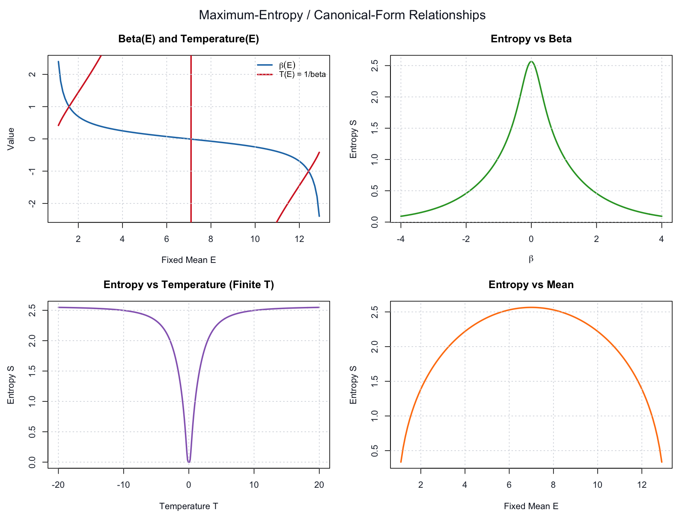

# Entropy Experiment in R

This project explores a maximum-entropy style model on a discrete state space $1,\ldots,13$, using a Boltzmann-form distribution:

$$
p(i) \propto \exp(-\beta i)
$$

## What this script does

1. Solves for $\beta$ from a target mean $E$ (`beta_from_mean`).
2. Computes entropy $S = -\sum_i p_i \log p_i$ from $\beta$ (`entropy_from_beta`).
3. Builds and plots the main relationships:
   - $\beta(E)$ and $T(E) = \frac{1}{\beta}$
   - $S(\beta)$
   - $S(T)$ with finite-temperature filtering
   - $S(E)$
4. Prints two titled tables:
   - A summary table of key example values
   - A probability table for $\beta = 0.5$

## Plot Preview

<p align="center">
  
</p>

## Improvements included

- Reduced excessive plotting by removing per-call plotting inside entropy calculations.
- Consolidated output into a compact 2x2 figure panel.
- Handled `Inf`/invalid cases in temperature-based plotting by filtering non-finite or near-zero $T$.
- Added clearer plot titles, grid styling, and a legend.
- Added titled tabular outputs for readability.

## Run

From this project folder, run:

```r
source("e-Bf.R")
```

You will see printed tables in the console and a single 2x2 figure window.

To regenerate the README preview image:

```sh
Rscript -e 'png("figures/entropy-relationships.png", width=1600, height=1200, res=150); source("e-Bf.R"); dev.off()'
```
